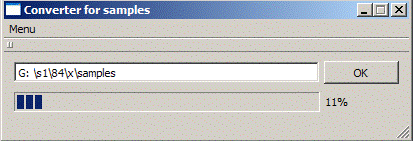

Задача
  В бинарном файле samples замените все отрицательные значения нулями (в файле находятся значения типа int). Создайте для этого отдельный поток, в котором проверяйте каждое значение и, если оно является отрицательным, замените его 0. Необходимо отобразить на ProgressBar сколько процентов осталось до окончания прохода по файлу. 
Интерфейс программы может выглядеть так:

